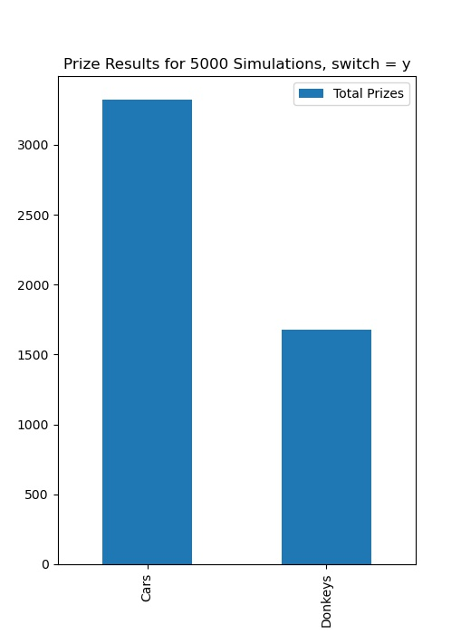

#### [View this project on GitHub](https://github.com/jgabunilas/monty-hall)

## Introduction

The Monty Hall problem is a classic problem in probability theory. Modeled as a game of chance and named after the eponymous game show host [Monty Hall](https://en.wikipedia.org/wiki/Monty_Hall), it has sparked debate, discussion, and discourse between academics and laypeople alike.  

This simple exercise is a Python implementation of the Monty Hall problem with two primary features:
1. A functional implementation which allows the user to play through the game
2. A simulator that runs through a chosen number of iterations of the game and sisplays the outcomes based on the parameters selected by the user.

This exercise is not intended to expand upon existing mathematical knowledge of the Monty Hall problem, which as been thoroughly solved both explicity and computationally. Instead, it is meant to showcase the use of Python data types as well as demonstrate basic use of Pandas dataframes and plotting functions. 

Monty Hall

---

## The Problem

While there are multiple variations of the problem, most incarnations (and the one used in this exercise) are based on the following premise:

1. The game show host presents the player with three doors and informs the player that two of the doors have a goat behind them, while the remaining door has a car. The player will win the prize that is hidden behind the door that they choose. Therefore, the player's objective is to choose the door that leads to the car while avoiding the two doors that lead to goats.
2. The player selects a door.
3. Before revealing what is behind the door that was selected by the player, the host first opens **one** of the two doors that the player *did not* select. The door that the host opens always reveals a goat.
4. The host asks the player if they would like to switch their selection to the final remaining unopened door, or stay with the door that they originally selected.
5. The player decides whether to stay with the current door or switch to the other unopened door.
6. The host opens the final door selected by the player and the prize is revealed.

The debate and discussion surrounding the problem stems from whether the player should switch doors after the host opens one of the doors with a goat in order to maximmize his or her chances of winning the car. The optimal solution to this incarnation of the problem can be reviewed in this [Wikipedia article](https://en.wikipedia.org/wiki/Monty_Hall_problem).  

*Spoiler alert: the best choice to maximize your chance of winning the car is to switch doors when offered. If you don't believe this to be true now, perhaps you will after running the simulations in **Part 2** of this project.*

---

## Part 1: Manual Game Play

Part 1 of this project is a functional implementation of the game that walks the player through the six steps presented above. The manual game is launched by selecting option 1 when prompted by the game. 

The basic outline of the program is as follows:
1. The three prizes (two goats and a car) are stored in a list called `choices`. This list is shuffled using the `random.shuffle()` function
2. The player is prompted to select either door 1, 2, or 3 using the `input()` function. Data validation ensures choices are limited to one of these three entries.
3.  Once the player has selected a door, the program then constructs a new list called `other_doors` that contains the numbers of the two doors that were *not* selected by the player (for example, if the player chose door 1, then `other_doors` will contain doors 2 and 3).  The `other_doors` list is then shuffled (see below for an explanation as to why this shuffle is necessary).
4.  The now-shuffled `other_doors` list is used to "check" the unchosen doors and open one that has a goat. The list is checked iteratively, starting at the first indexed position `0`. If the first door in the list has a goat, that door is opened and the goat is revealed to the player. If the first door in the list has a car, then the second door in the list (at index 1) is opened and the goat is revealed to the player.
    * This iterative checking procedure illustrates the need to shuffle the `other_doors` list. The unchosen door that is opened must **always** reveal a goat. If this list is not shuffled and is checked iteratively (incrementally from index 0 onward), then the attentive player will begin to recognize patterns of which doors are opened based on his or her original selection.
    * For example, when a player chooses door 1:
        * If the car is behind door 1, then both doors 2 and 3 have goats. Since the list is checked iteratively, then in an unshuffled list, door 2 will always be checked and opened first.
        * Thus, over many iterations, a player may realize that whenever door 2 is opened to reveal a goat, there is a higher-than-average chance that door 1 has a car. By shuffling the `other_doors` list, there is a chance to check door 3 for a goat first, thereby greatly reducing the changes of pattern recognition by the player.
5. The player is prompted via `input()` to choose whether to switch to the remaining unopened door ("y") or stay with the original chosen door ("n"). Again, data validation ensures the integrity of the entry.
6. The final door that the player has chosen is opened, and the prize is revealed. Additionally, the player is informed of whether a car or a goat was behind the door that was selected at the beginning of the game.

---

## Part 2: Simulation

Part 2 allows the user to run multiple iterative simulations of the Monty Hall problem and view the outcomes in aggregate. It is launched by selecting option 2 when prompted by the game. 

The basic outline of the program is as follows:
1. The player is prompted via `input()` to enter the number of simulations, which is stored in the variable `num_sims`. Data validation via a *try and except* clause ensures that the entry is an integer value.
2. The player is next prompted via `input()` to choose whether, the program will switch doors ("y") or remain with the originally-selected door ("n"). The value is stored as the varaible `switch` and is applied to every simulation in the run.
3. Once input is received, an empty `results` list is created that will eventually store the result of each simulation that is performed.
4. Next, for each simulation that is run, the program executes the function `run_sim()`. This function accepts the `switch` variable as an argument and performs the following:
    * Creates a list called `choices` which holds the three prizes (one car and two goats).
    * A prize within `choices` is chosen at random using `random.choice`, and is stored as the variable `initial_choice`. This simulates the selection of the initial door by the player.
    * The randomly-chosen prize (car or goat) is removed from the `choices` list.
    * Next, one goat is removed from the `choices` list to simulate the opening of the unchosen door to reveal a goat. Thereafter, the `choices` list will contain just one final item, which is saved as the variable `remaining_choice`.
    * If the player directed the simulator to switch doors, the variable `prize` will be set equal to `remaining_choice`. If the player directed the simulator to stay with the initial door, then the `prize` variable will be set equal to `initial_choice`.
    * The function returns a tuple containing `initial_choice` and `prize`.
5. The returned value of the `run_sim()` function call is appended to the `results` list.
6. After all simulations have been executed, the program iterates through the `results` list and constructs a `final_prizes` list using the `prize` values from each tuple in `results`.
7. The program iterates through the `final_prizes` list and sums the total number of goats and cars. It stores these sums as `total_goat_prizes` and `total_car_prizes`, respectively. It also calculates the percentage of prizes are goats and cars and stores these values as `percent_goats` and `percent_cars`.
8. The program prints out the total numbers and percentages of car and goat prizes.
9. The program creates a Pandas dataframe with **Total Prizes** and **Percent** and uses this frame to create a simple bar graph that plots the number of car and goat prizes based on the number of simulations run.

