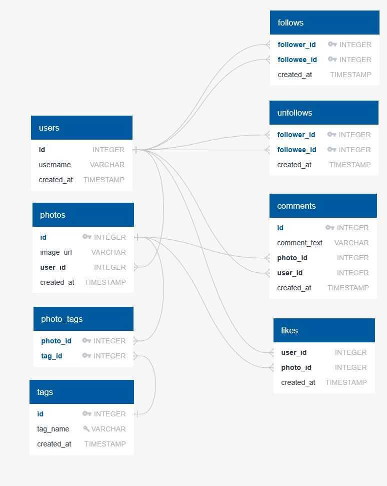
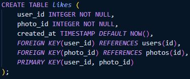
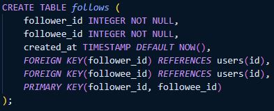
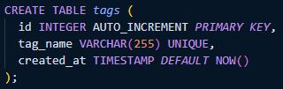
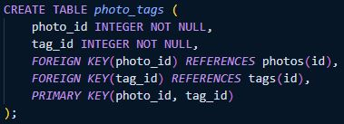
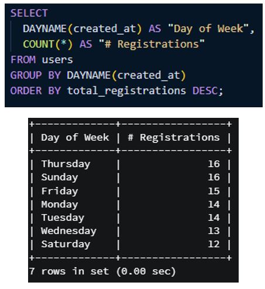
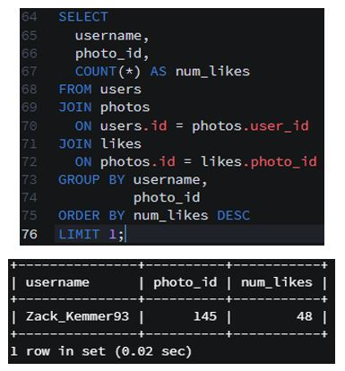
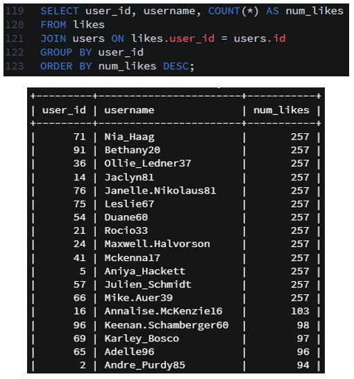

A SQL relational database exercise

<!--more-->


#### [View project files in Github](https://github.com/jgabunilas/mysql_bootcamp/tree/main/Section%2014-15%20-%20Instagram%20Database%20Clone)

## Introduction

In this project, we construct a relational database that is intended to mimic the basic functionality of a social media application. First, the database tables are defined, with key relationships established between them to enable the desired functionalities and enforce data integrity. Next, the tables are loaded with fictional data representing users, objects and actions for a typical social media site, including Likes, Comments, Photos, and Follows. Lastly, SQL commands are used to explore the data and uncover insights about the application and the behavior of its users.

This project was completed as part of the [Ultimate MySQL Bootcamp](https://www.udemy.com/course/the-ultimate-mysql-bootcamp-go-from-sql-beginner-to-expert/) course by Colt Steele. 

---

## Part I: Defining the Database Schema 

The overall schema for the database is as follows:

[](https://jgabunilas.github.io/images/db_schema.JPG)

The individual tables were designed as follows:

### users


The `users` table represents the users of the social media application and contains three columns:
- **id**: a unique integer id for the user which also serves as a *primary key*. Additionally, the user id is a *foreign key* for many of the other tables.
- **username**: the username for the user. A username is required.
- **created_at**: a timestamp that indicates when the user was added to the database. Defaults to the current time

### photos


The `photos` table represents the photos that are posted to the application and contains four columns:
- **id**: a unique integer id for the photo which also serve as a *primary key*
- **image_url**: the URL where the image is located. A URL is required.
- **user_id**: the user to whom the photo belongs. This is a required field in order to avoid "orphan photos" with no owners. It is also a *foreign key* that references `users.id`, such that the owner must be an existing user of the application.
- **created_at**: a timestamp that indicates when the photo was added


### comments


The `comments` table tracks comments that users make on photos. It contains three columns:
- **id**: a unique integer id for the comment
- **comment_text**: the textual content of the comment
- **photo_id**: the id of the photo for which the comment has been left. It is a *foreign key* that references `photos.id`.
- **user_id**: the id of the user who has left the comment. It is a *foreign key* that references `users.id`.
- **created_at**: a timestamp that indicates when the comment was created

### likes


The `likes` table tracks the likes that users give to photos. It contains three columns:
- **user_id**: the id of the user who is giving the like. It is a *foreign key* that references `users.id`. It also forms a *composite key* with **photo_id**.
- **photo_id**: the id of the photo to which the like is given. It is a *foreign key* tha references `photos.id`. It also forms a *composite key* with **user_id**.
- **created_at**: a timestamp that indicates when the like was given

### follows


The `follows` table tracks which users are followed by other users on the social media application. It consists of three columns:
- **follower_id**: the user id of the user who is following another user. It is a *foreign key* that references `users.id`. It also forms a *composite key* with **followee_id**.
- **followee_id** the user id of the user who is being followed. It is a *foreign key* that references `users.id`. It also forms a *composite key* with **follower_id**.
- **created_at**: a timestamp that indicates when the follower began following the followee

If a user attempts to follow themselves, the following *database trigger* prevents them from doing so:
```
DELIMITER $$

CREATE TRIGGER prevent_self_follows
     BEFORE INSERT ON follows FOR EACH ROW
     BEGIN
         IF NEW.follower_id = NEW.followee_id
         THEN   
             SIGNAL SQLSTATE '45000'
                 SET MESSAGE_TEXT = "You cannot follow yourself.";
         END IF;
     END;
$$

DELIMITER ;
```

### unfollows


The `unfollows` table allows us to track when users decide to unfollow other users. It consists of three columns:
- **follower_id**: the user id of the user who unfollows another user. It is a *foreign key* that references `users.id`. It also forms a *composite key* with **followee_id**.
- **followee_id** the user id of the user who is unfollowed by another user. It is a *foreign key* that references `users.id`. It also forms a *composite key* with **follower_id**.
- **created_at**: a timestamp that indicates when the follower stopped following the followee.

When a row is deleted from the `follows` table (thereby indicating that an unfollow has occured), the following *database trigger* adds the deleted follower/followee pair to the `unfollows` table:
```
CREATE TRIGGER create_unfollow
    AFTER DELETE ON follows FOR EACH ROW 
BEGIN
    INSERT INTO unfollows
    SET follower_id = OLD.follower_id,
        followee_id = OLD.followee_id;
END$$
```

### tags


The `tags` table catalogs the unique tags (commonly known as *hashtags* in popular social media applications) that are available for users to apply to photos. It consists of two columns:
- **id**: the unique integer id of the tag. It is a *primary key*.
- **tag_name**: the textual name of the tag
- **created_at**: a timestemp that indicates when the tag was created

### photo_tags


The `photo_tags` table tracks which tags have been applied to which photos in the `photos` table. In this way, the `photo_tags` table relates to the tags to the photos. It consists of two columns:
- **photo_id**: the id of the photo to which the tag has been applied. It is a *foreign key* that references `photos.id`. It also forms a *composite key* with **tag_id**.
- **tag_id**: the id of the tag that has been applied to the photo. It is a *foreign key* that references `tags.id`. It also forms a *composite key* with **photo_id**. 

---
## Part 2: Populating the Database

The database tables are next populated with a large set of fictional data representing users, photos, comments, likes, and so forth. The data can be viewed [here](https://github.com/jgabunilas/mysql_bootcamp/blob/main/Section%2014-15%20-%20Instagram%20Database%20Clone/ig_clone_data.sql).

---
## Part 3: Insights

The relational database is now populated and can be explored to develop new insights about the users and contents of the application.

#### Longest-tenured users
To determine the users who have been using the application the longest, we need only explore the `users` table.


#### Choosing a day to air advertisements to new users
Suppose our goal is to launch a new advertising campaign that will reach the greatest number of *new* users, but due to bandwidth issues we can only advertise one day per week. We are therefore interested in determining the day(s) on which new users sign up most frequently. Again, all of the necessary data is contained with the `users` table, where we can use series of string commands to count how many times a new registration timestamp was created on each day of the week. 



The data suggests that an ad will be seen by most new users on a Thursday or a Sunday.

#### Find users who have never posted a photo
We next want to send out an engagement email out to users who have registered for the application, but have never posted a photo. For this exercise we work with the `users` and `photos` tables. With the following table join, we can determine which users have no photos associated with their accounts


#### Finding the most popular photo
Social media is all about popularity and getting as many *likes* as possible. To find which photo is the most popular, we perform a join on the `users`, `photos`, and `likes` tables. First, we join `users` and `photos` by the user id (many users will have more than one photo). Next, the `likes` table is joined to the combined `users`-`photos` table by photo id. Since photos can have more than one like, the resulting table will have duplicate rows for photos that received multiple likes. To count the likes, we group the replicates by **username** and **photo_id**, then perform a count on the groupings. By sorting and limiting the output, we determine the most popular photo, its owner, and how many likes it has received.



#### Calculating how many photos the average user posts
Since this is photo-based social media application, we want to know how many photos our users are uploading, on average. We have enforced that all users and photos must be unique, and so we can calculate this by simply dividing the total number of photos by the total number of users. 


#### Determining the most commonly-used hashtags
Hashtags can be annoying, but they serve a purpose. In our fictional application, we're interested in which of the tags our users are utilizing the most. We start by joining the `photo_tags` table with the `tags` table on the tag id. Because the same tag can be used for multiple photos, we next perform a `GROUP BY` on the **tag_id** and count the number of times each tag id occurs in the joined table (aliasing the sum as **frequency**). We can sort the results in descending order and limit the output to the tags with the highest counts. The final selection involves only the tag names and the number of occurrences of those tags.


#### Rooting out bots
Bots are unwelcome on social media applications, including ours. We therefore seek to root out bots by determine the users who have *liked every single photo within the application*. To find said bots, we need to make use of a few key pieces of information:
- The total number of photos in our database, which in our case is 257 photos.
- The fact that a user can only like each photo at most one time
Thus, bot users (or perhaps real users who genuinely enjoy making people happy) will be those who have given the same number of *likes* as there are photos.  

The query itself is fairly simple. We join the `likes` and `users` table by user id, then gorup by **user_id** and count the number of times each user appears in the joined table. The users who have give the highest number of likes, equal to the number of photos in the database, are likely to be bots.



Instead of counting and sorting for the users giving out the most likes, an alternative approach is to directly count the number of photos and then using the `HAVING` function to select users who have given a number of likes equal to the number of total photos.

