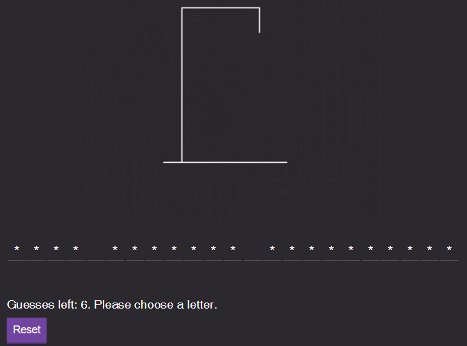
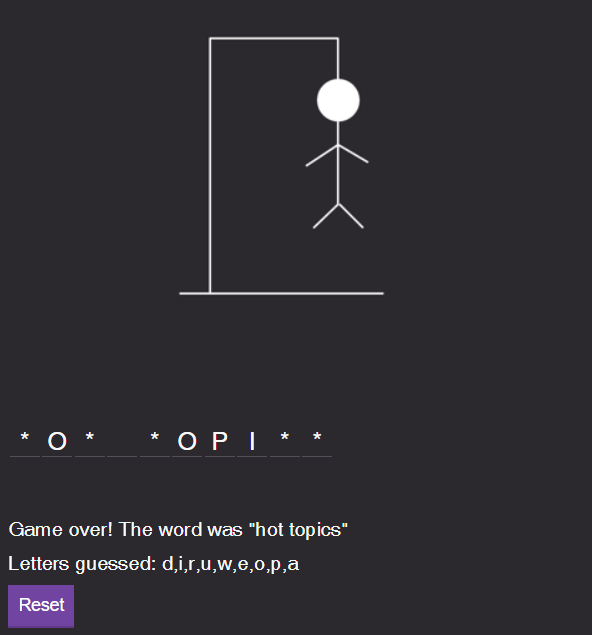

A JavaScript twist on the classic word guessing game

<!--more-->


#### [View this project on Github](https://github.com/jgabunilas/hangman)
#### [Play the game](https://jgabunilas.github.io/hangman/)

## Introduction

This application is an interactive web-based implementation of the classic [Hangman](https://en.wikipedia.org/wiki/Hangman_(game)) game. In this game, the player is presented with an unknown word or phrase with no letters filled in and is only given information about the layout of the phrase, such as how many letters are in the phrase and how the words are spaced out. The player is allowed a limited number of letter guesses in order to determine the word or phrase. The player is also typically presented with an image of an empty gallows, onto which a stick figure is drawn as the player makes incorrect guesses.

- If the guessed letter is part of the phrase, that letter is uncovered in all applicable locations. The player is not penalized for a correct guess.
- If the guessed letter is not part of the phrase, the player is penalized one guess and an additional "component" of the stick figure is drawn in.
- If the player is able to guess all letters of the phrase without running out of incorrect guesses, the player wins the game.
- If the player runs out of guesses, the player loses the game and the image of the hanging stick figure is completed.


The base version of this application is written in JavaScript and was constructed as part of the [Modern JavaScript Bootcamp](https://www.udemy.com/course/modern-javascript/) course by Andrew Mead. The simple illustrations were created by me. 


---
## Gameplay Images
Game Start  


Game In Progress  


Victory   


Loss  


---
## Application Details

The application is split into three primary files that are described in greater detail below.

### app.js
This is the primary script file containing the code responsible for the initialization of website and DOM elements. It defines functions for dynamically rendering the game to the page (`renderGame()`) and initializing the puzzle for the game (`startHangmanGame()`), and calls all the necessary methods to create the DOM representation for the puzzle (see **hangman.js** for additional details). Additionally, **app.js** contains event listeners for key presses (for registering letter guesses) and the reset button to restart the game with a new puzzle. 

### requests.js
This file contains a single used function, `getPuzzle()`, that queries a phrase-generating API. The API returns a JSON object containing the phrase to be used for the puzzle. The JSON is parsed to obtain the phrase, which is returned by the `getPuzzle()` function. `getPuzzle()` is called by the `startHangmanGame()` function in **app.js**.

### hangman.js
This hangman application utilizes object-oriented programming, treating each phrase used in the game as an instance object of the class `Hangman`. **hangman.js** defines all of properties and methods used by the `Hangman` class.
- The constructor function initializes the relavant properties of the instance, including the word, an empty array to collect the letters guessed, an integer variable tracking the number of incorrect guesses remaining, and the status of the game. 
- `Puzzle()`: a getter function that iterates over each letter in the phrase and determines whether it is in the array of guessed letters. If the letter has been guessed, then the letter will be appended to a `puzzle` string. If the letter has not been guessed, an asterisk will be appended instead. The constructed `puzzle` string with letters and/or asterisks is returned by the getter function. 
- `guessLetter()`: takes as an argument the letter that is guessed by the player via key press. Thus, it is called by the event handler that listens for key presses. If the game is still in session (the player has not yet lost), then `guessLetter()` adds the letter to the array of guessed letters if it is not already in that array. If the guessed letter is not in the puzzle phrase, the player is penalized by subtracing 1 from the number of incorrect guesses remaining 
```
this.attemptsRemaining --
```
- `generatePuzzleDOM()`: creates an HTML `<span>` element for each letter in the puzzle
- `generateStatusDOM()`: checks the status of the game ("playing", "failed", or "finished") and generates a status message based on that status. If "playing", the message displays the number of incorrect guesses remaining. If "failed", the message reveals the phrase. If "finished", the message congratulates the player for guessing the word or phrase. The status message is passed to the `#status-msg` DOM element to be displayed on the page.
- `generateGuessedLettersDOM()`: checks whether the array of guessed letters has a length of 1 or greater. If so, the `#guessed-letters` DOM element is edited to display the array of guessed letters.
- `statusMessage`: a getter function that returns the status of the game. The default status is "playing", and this function will change the status to "finished" if there are no asterisks reamining in the puzzle (i.e. the player has successfully guessed all letters), or to "failed" if the `attemptsRemaining` variable has decreased to 0.
- `updatePicture()` is called by the `renderGame()` function and ensures that the correct hanging figure image is displayed based on the number of incorrect guesses that have been made (or more precisely, the number of incorrect guesses that the player has remaining). The picture becomes progressively more "complete" as the player continues to make incorrect letter guesses. When applicable, the picture is updated by setting the `src` attribute of the `img` DOM element to the new picture filename.
