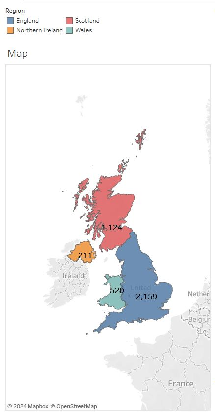
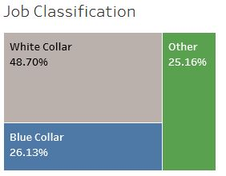
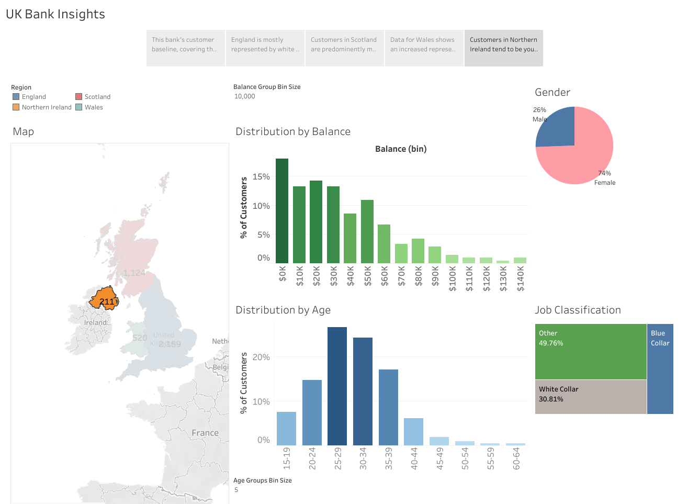

An interactive Tableau BI dashboard

<!--more-->

#### [View the Dashboard on Tableau Public](https://public.tableau.com/views/UK-Bank-Customers_16529247454400/UKBankInsights?:language=en-US&:sid=ABFE474F1B054052A6F1B1D5B41A53BF-0:0&:display_count=n&:origin=viz_share_link)

## Introduction

Most businesses would benefit to understand as much as possible about their customers, and financial institutions are no different. In this project, we dive into a dataset for a fictional bank in the United Kingdom (UK) that serves customers in all UK member countries (England, Scotland, Northern Ireland, and Wales). By learning more about its customers, the bank can tailor its services to be most relevant to each customer segment.

This dashboard was constructed as part of the [Tableau A-Z: Hands-On Tableau Training for Data Science](https://www.udemy.com/course/tableau10/) course on Udemy, taught by Kirill Eremenko.

---

## The Dataset

This fictional dataset describes the 4014 customers of a fictional UK bank. The information summarized in the file include:
- Customer ID
- Given name
- Surname
- Gender (Male or Female)
- Age
- Country within the UK (England, Scotland, Northern Ireland, or Wales)
- Job classification (White Collar, Blue Collar, or Other)
- Date that the customer joined the bank
- Total account balance at the bank

The dataset is available [here](https://sds-platform-private.s3-us-east-2.amazonaws.com/uploads/P1-UK-Bank-Customers.csv).

---

## Dashboard Visualizations

The dashboard contains five interactive visualizations. By default, all visualizations describe the full, unfiltered data set. However, filtering is enabled for all visualizations - selecting a specific segment of any visualization will cause the remaining visualizations to be filtered by that selection. 

### UK Map
  

The map visualization contains a color-coded map of the British isles, with each country in the UK being colored uniquely. By default, the visualization displays the total number of bank customers in each country. 

### Customer Balance Distribution
  

This histogram presents the distribution of customers by **account balance**. Balance bins are dynamic and be selected by the user by adjusting the *Balance Group Bin Size* slider. The customers in each balance bin are quantified as percentage of total customers. By default, it displays the balance data for all customers in the dataset.

### Customer Age Distribution

This histogram presents the distribution of customers by **age**. The bins have been customized via a calculated field to show the range of ages that fall into each bin. By default, it displays the age data for all customers in the dataset. The age bin sizes are adjustable with the *Age Groups Bin Size* slider.

### Customer Gender Segmentation
  

The gender segmentation within the dataset is presented in a pie chart, which displays the percentages of male and female customers. By default, it includes all customers in the dataset.

### Job Classification Tree Diagram

This diagram shows the percentage of customers who belong to White Collar, Blue Collar, or Other job classifications. 

---
## Analysis

### UK-wide Data

Starting with the full dataset provides a baseline understanding of the customer base against which more target analyses can be compared. From the high-level nation-wide view, several insights become apparent:
- Most of the bank's customers are in England. There are more English customers than Scottish, Welsh, and Northern Irish customers combined. However, it is important to bear in mind that the population of England is roughly five times larger than the combined populations of the remaining three countries. Therefore, England's larger number of customers may be a result of a much larger customer pool in that country. In fact, the English customer enrollment *per capita* is actually much lower than in the other UK nations. Perhaps the bank should work to improve its advertising efforts in England order to connect with the very large potential customer base there.
- Across the entire UK, larger percentages of customers tend to fall into the lower balance bins. In other words, there a more customers with lower balances than customers with higher balances. This may reflect the general wealth distribution in the UK.
- Roughly 40% of all customers are in their 30s and likely in the earlier stages of their careers. The bank could possibly consider early-career financial instruments to offer to this large group of customers. 
- A small majority of UK customers are male

### Country-specific Observations
Next, we explore specific segments of the dataset to determine to learn more about our customers in a more targeted fashion.

#### England

- The majority of the bank's English customers are white collar workers, with a narrow majority (51%) of the customers being female. 
- Otherwise, England's customer distribution is very similar to the UK as a whole in terms of age and account balances, which is perhaps not surprising given that English customers make up more than half the bank's customer base and heavily influence the data set.

#### Scotland

- Centering the analysis on Scotland reveals a significant demographic shift in the bank's customers. Nearly three-quarters of the bank's Scottish customers are male. Furthermore, nearly half are blue collar workers.
- The age distribution also shifts heavily to the right, with the vast majority of customers being 40-60 years old
- When filtering specifically for blue collar customers, we see that 95% of them are male.
- Depending on the goals of the bank, they may consider increasing marketing efforts toward white collar workers in order to increase the proportion of high-balance accounts in Scotland. 

#### Wales

- The customer age and job classification distribution is Wales is fairly consistent with that of the UK overall
- However, Wales is notable for its high representation of small-to-mid sized account balances. While the UK as a whole sees a gradual decline of customers with increasing account balances, Wales shows a noticeable increase in customers in the $15k-30k range when compared to smaller account balances. 

#### Northern Ireland

- Northern Ireland stands apart from the rest of the bank's UK customers in that nearly two-thirds of its customers are female. Furthermore, female Northern Irish customers hold solid majorities in all job classifications.
- Irrespective of age or gender, Northern Ireland has a notably younger age distribution when compared the rest of the UK. 

---
## Conclusion
This exercise illustrates Tableau's data visualization capabilities in the assessment of a fictional corporation's customer base. While the goal of most for-profit companies (including banks) is the generate as much revenue as possible, to do so, they must make their business relevant to the customers they serve. By developing these insights, this bank can assess what types of services it offers and determine strategies to not only to engage with new customers, but also to retain and grow its relationships with existing customers.

What other insights do you think can acquired from this data? Explore the dashboard and find out!